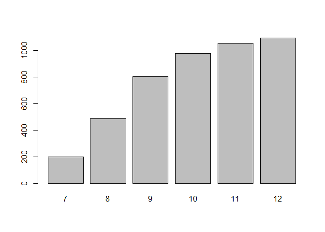
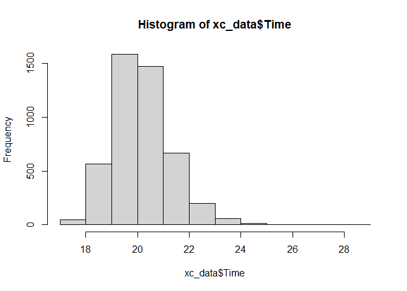
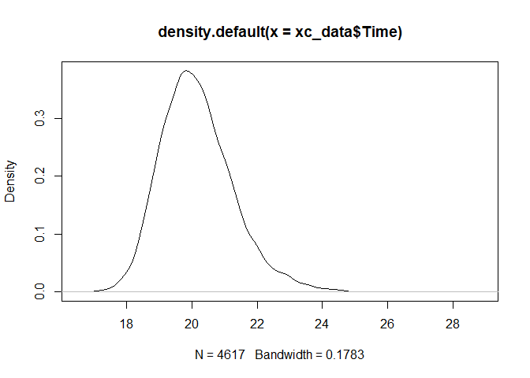
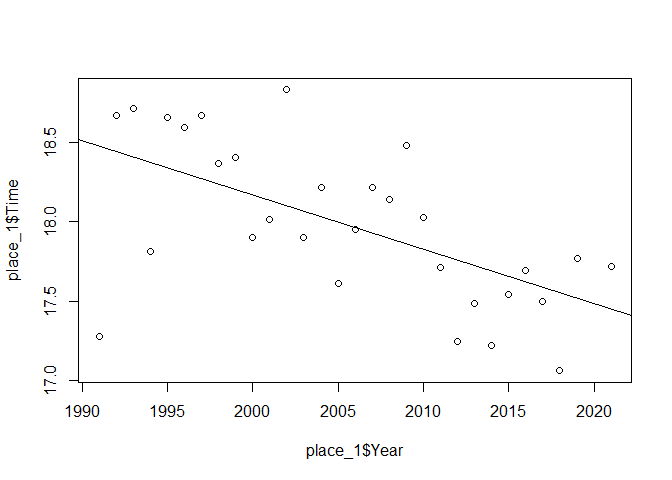
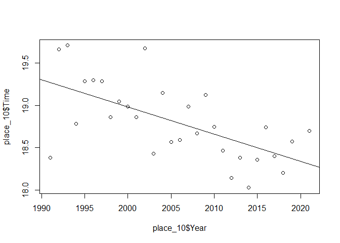
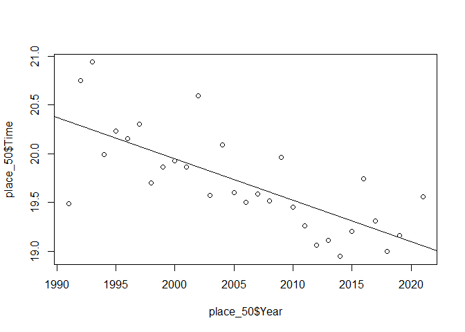
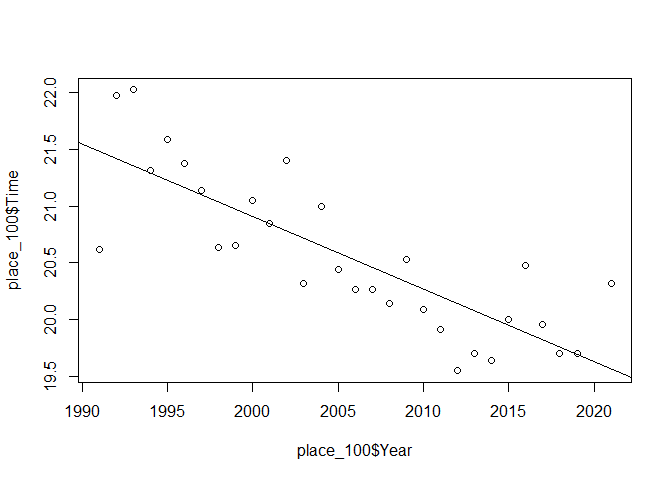
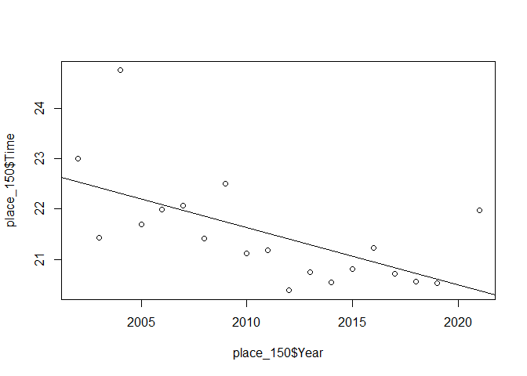

# Introduction High School Girls Cross Country Trends

## What

My project is about trends in Minnesota girls high school cross country.
I want to show how, on average, the race times have gotten faster every
year and that the talent pool has deepened. I also want to prove that
placing well when you are younger does not guarantee success as you age.

## Why

I’ve followed cross country and track for almost 20 years now; it is my
‘fantasy football’ basically. I’ve noticed that, over time, the
performances have been consistently getting better and I wanted to prove
it statistically. I’ve also had several internet forum discussions
regarding girls who are deemed ‘prodigies’ at a young age and I am
looking forward to providing evidence as to why doing well in 9th grade
doesn’t always translate to doing well in 12th graded.

## How

In addition to trend fitting, I am going to be making use of subsets to
be able to really look at how the data changes within particular groups.
I will also be using a data filter to find runners who have appeared
more than once in the data set.

# Body

## Why Cross Country

Cross country is running long distances while not on a track. Some races
are done on various trails while others are done on golf courses.
Minnesota hold their cross country championships on a golf course, which
has remained at the same place since 1992. Boys cross country state
meets started in 1943 while girls meets started in 1975. Approcahces to
Coaching philosophies, gear, nutrition and exposure to cross country on
a bigger stage have all shifted over the years, which also contributes
to the changing of running averages. I chose cross country over track
because there is more data and I chose girls cross country because girls
are often overlooked when people talk about MSHSL history.

## The Data

I used the data found on [Raceberry
Jam](https://www.raceberryjam.com/indexcc.html). This site has complete
data from 1991 in a semi-usable format. There is older data out there
but it isn’t formatted as well and is missing various data points, such
as times. I copied and pasted it into Notepad++ and used regular
expressions to re-format it into something more usable. I replaced all
double white space with a comma (to perserve names in one column),
replaced any double commas with a single comma (sometimes more than
once) and then saved it to a CSV file. The original data looked
something like this -

    1        Megan Hasz, 11                5:15.2    13:40.9    Alexandria           
    2        Bethany Hasz, 11              5:15.4    13:44.4    Alexandria           
    3        Tess Misgen, 10               5:23.3    14:13.5    Shakopee             
    4     1  Emma Benner, 11               5:25.8    14:13.6    Forest Lake          
    5        Emily Covert, 8               5:24.8    14:15.0    Minneapolis Washburn 
    6     2  Rachel King, 12               5:26.5    14:15.1    St. Michael-Albertvil 
    7     3  Anna French, 12               5:17.6    14:15.9    Wayzata              
    8     4  Annika Lerdall, 10            5:39.7    14:18.4    Wayzata              
    9     5  Emily Betz, 12                5:27.0    14:19.0    East Ridge      

The first column is the place, the second column is the team place,
followed by name, grade, average time, overall time and school. I wasn’t
interested in the team place or the average time so I needed to delete
those. I created a macro to delete all the cells where there was a team
place and shift the remaining cells in that row over. That made it
easier to just delete the average time column once everything was
aligned. For all the times prior to 2015 I had to convert them to their
equivalent 5k times using this equation:

$$
t2 = t1 \* (\\frac{d2}{d1})^{1.06}
$$

There was some trouble with this since the formatting wasn’t always
consistent. Out of the 4617 lines of data, I had to change about 20 by
hand. I also added an index in case I needed a unique number per row but
I am not sure if I really need it.

# Using the data in R

To use the data in R, I used the readr library and then imported the
data into an R table using instructions from
[Statology](https://www.statology.org/import-csv-into-r/).

    library(readr)

    xc_data <-read_csv("XC.csv")

    ## Rows: 4617 Columns: 6
    ## -- Column specification -------------------------------------------------------------------------------------------------
    ## Delimiter: ","
    ## chr (2): Name, School
    ## dbl (4): Place, Grade, Time, Year
    ## 
    ## i Use `spec()` to retrieve the full column specification for this data.
    ## i Specify the column types or set `show_col_types = FALSE` to quiet this message.

I first wanted to check to make sure that the data imported correctly.

    head(xc_data)

    ## # A tibble: 6 x 6
    ##   Place Name             Grade  Time School  Year
    ##   <dbl> <chr>            <dbl> <dbl> <chr>  <dbl>
    ## 1     1 Carrie Tollefson     9  17.3 Dblv    1991
    ## 2     2 Tina Forthmiller    10  17.9 StF     1991
    ## 3     3 Kara Wheeler         8  17.9 DuE     1991
    ## 4     4 Amy Hill             8  17.9 DuE     1991
    ## 5     5 Keri Zweig          11  18.1 Mtk     1991
    ## 6     6 Turena Johnson      11  18.1 Brn     1991

I then wanted to see just how many runners from each grade there were
overall:

    table(xc_data$Grade)

    ## 
    ##    7    8    9   10   11   12 
    ##  198  485  805  979 1056 1094

A plot of the above table:

    barplot(table(xc_data$Grade))

Average and standard deviation of all the running times:

    mean(xc_data$Time)

    ## [1] 20.17357

    sd(xc_data$Time)

    ## [1] 1.125184

I thought it would be interesting to see what buckets the race times
fell into:

    hist(xc_data$Time)

And then do a density graph of those times:

    plot(density(xc_data$Time))

 Let’s
look at the data for a few specific places:

    place_1 <- subset(xc_data, xc_data$Place == 1)
    place_10 <- subset(xc_data, xc_data$Place == 10)
    place_50 <- subset(xc_data, xc_data$Place == 50)
    place_100 <- subset(xc_data, xc_data$Place == 100)
    place_150 <- subset(xc_data, xc_data$Place == 150)
    head(place_1)

    ## # A tibble: 6 x 6
    ##   Place Name             Grade  Time School                 Year
    ##   <dbl> <chr>            <dbl> <dbl> <chr>                 <dbl>
    ## 1     1 Carrie Tollefson     9  17.3 Dblv                   1991
    ## 2     1 Lisa Aro            11  18.7 Buffalo                1992
    ## 3     1 Kara Wheeler        10  18.7 Duluth East            1993
    ## 4     1 Carrie Tollefson    12  17.8 Lac Qui Parle Val/D B  1994
    ## 5     1 Elaine Eggleston    11  18.7 Roseville Area         1995
    ## 6     1 Josie Johnson        8  18.6 Rochester John Marshl  1996

Plotting the times with a line fit and coefficients for 1st place:

    plot(place_1$Year, place_1$Time)
    abline(lm(place_1$Time ~ place_1$Year))

    summary(lm(place_1$Time ~ place_1$Year))$coefficients

    ##                 Estimate   Std. Error   t value     Pr(>|t|)
    ## (Intercept)  86.91625574 17.113507120  5.078810 2.235757e-05
    ## place_1$Year -0.03437327  0.008533065 -4.028245 3.895416e-04

Plotting the times with a line fit and coefficients for 10th place:

    plot(place_10$Year, place_10$Time)
    abline(lm(place_10$Time ~ place_10$Year))

    summary(lm(place_10$Time ~ place_10$Year))$coefficients

    ##                  Estimate   Std. Error   t value     Pr(>|t|)
    ## (Intercept)   83.19128489 15.046381898  5.528989 6.546892e-06
    ## place_10$Year -0.03210604  0.007502363 -4.279457 1.978128e-04

Plotting the times with a line fit and coefficients for 50th place:

    plot(place_50$Year, place_50$Time)
    abline(lm(place_50$Time ~ place_50$Year))

    summary(lm(place_50$Time ~ place_50$Year))$coefficients

    ##                   Estimate  Std. Error   t value     Pr(>|t|)
    ## (Intercept)   104.79318412 14.93893837  7.014768 1.251463e-07
    ## place_50$Year  -0.04242236  0.00744879 -5.695201 4.168772e-06

Plotting the times with a line fit and coefficients for 100th place:

    plot(place_100$Year, place_100$Time)
    abline(lm(place_100$Time ~ place_100$Year))

    summary(lm(place_100$Time ~ place_100$Year))$coefficients

    ##                    Estimate   Std. Error   t value     Pr(>|t|)
    ## (Intercept)    148.94465149 16.947296286  8.788697 1.535169e-09
    ## place_100$Year  -0.06401809  0.008450189 -7.575936 2.979356e-08

Plotting the times with a line fit and coefficients for 150th place:

    plot(place_150$Year, place_150$Time)
    abline(lm(place_150$Time ~ place_150$Year))

    summary(lm(place_150$Time ~ place_150$Year))$coefficients

    ##                   Estimate  Std. Error   t value    Pr(>|t|)
    ## (Intercept)    251.0156516 72.83957329  3.446144 0.003083756
    ## place_150$Year  -0.1141237  0.03621949 -3.150891 0.005831822

As you can see, there is noticeable difference between the trends from
1st place to 150th place.

    -0.03437327*60

    ## [1] -2.062396

    -0.1141237*60

    ## [1] -6.847422

The first place times decreased, on average, of about 2 seconds per year
while the 150th place times decreased at a rate of -6.8 seconds a year.

    -2.062396*30/60

    ## [1] -1.031198

    -6.847422*30/60

    ## [1] -3.423711

The girls in 1st place are about a minute faster and the girls in 150th
place are about 3.5 minutes faster compared to 30 years ago.

Now I wanted to break up the data by each grade:

    data_7 <- subset(xc_data, xc_data$Grade == 7)
    data_8 <- subset(xc_data, xc_data$Grade == 8)
    data_9 <- subset(xc_data, xc_data$Grade == 9)
    data_10 <- subset(xc_data, xc_data$Grade == 10)
    data_11 <- subset(xc_data, xc_data$Grade == 11)
    data_12 <- subset(xc_data, xc_data$Grade == 12)
    head(data_7)

    ## # A tibble: 6 x 6
    ##   Place Name             Grade  Time School       Year
    ##   <dbl> <chr>            <dbl> <dbl> <chr>       <dbl>
    ## 1    65 Molly Aberg          7  19.8 Wbl          1991
    ## 2    40 Mandy Dockendorf     7  20.5 Rocori       1992
    ## 3    95 Tracy Musech         7  21.8 Hibbing      1992
    ## 4    30 Kelly Brinkman       7  20.3 Hutchinson   1993
    ## 5    98 Megan Daymont        7  22.0 Northfield   1993
    ## 6    53 Kendall Wheeler      7  20.0 Duluth East  1994

Standard deviation of the times per grade:

    sd(data_7$Time)

    ## [1] 0.8581629

    sd(data_8$Time)

    ## [1] 1.028409

    sd(data_9$Time)

    ## [1] 1.086925

    sd(data_10$Time)

    ## [1] 1.172572

    sd(data_11$Time)

    ## [1] 1.135137

    sd(data_12$Time)

    ## [1] 1.181283

Average of the times per grade:

    mean(data_7$Time)

    ## [1] 20.18436

    mean(data_8$Time)

    ## [1] 20.0755

    mean(data_9$Time)

    ## [1] 20.1391

    mean(data_10$Time)

    ## [1] 20.20532

    mean(data_11$Time)

    ## [1] 20.17808

    mean(data_12$Time)

    ## [1] 20.20771

Averages of the place per grade:

    mean(data_7$Place)

    ## [1] 91.40404

    mean(data_8$Place)

    ## [1] 79.62474

    mean(data_9$Place)

    ## [1] 77.39255

    mean(data_10$Place)

    ## [1] 78.74668

    mean(data_11$Place)

    ## [1] 77.41951

    mean(data_12$Place)

    ## [1] 76.45338

Seeing this has re-oriented my thoughts on the younger runners a little
bit. I think that some of the 7th graders are filling empty slots on
smaller teams so not all of them would finish very high.

Now I wanted to find all the runners who have made at least 2 trips to
the championship race:

    multi_run <- xc_data %>% group_by(xc_data$Name) %>% filter(n()>1)
    multi_run

    ## # A tibble: 3,154 x 7
    ## # Groups:   xc_data$Name [1,120]
    ##    Place Name              Grade  Time School  Year `xc_data$Name`   
    ##    <dbl> <chr>             <dbl> <dbl> <chr>  <dbl> <chr>            
    ##  1     1 Carrie Tollefson      9  17.3 Dblv    1991 Carrie Tollefson 
    ##  2     2 Tina Forthmiller     10  17.9 StF     1991 Tina Forthmiller 
    ##  3     3 Kara Wheeler          8  17.9 DuE     1991 Kara Wheeler     
    ##  4     4 Amy Hill              8  17.9 DuE     1991 Amy Hill         
    ##  5     5 Keri Zweig           11  18.1 Mtk     1991 Keri Zweig       
    ##  6     6 Turena Johnson       11  18.1 Brn     1991 Turena Johnson   
    ##  7     8 Julie Golla           9  18.3 Rjm     1991 Julie Golla      
    ##  8    12 Stephanie Simones    10  18.4 Msw     1991 Stephanie Simones
    ##  9    13 Andrea Lentz         10  18.5 Wil     1991 Andrea Lentz     
    ## 10    15 Barb Jones            9  18.6 Wbr     1991 Barb Jones       
    ## # ... with 3,144 more rows

The ratio of runners who ran in the championships more than once versus
overall per grade:

    sum(multi_run$Grade==7)/sum(xc_data$Grade==7)

    ## [1] 0.7272727

    sum(multi_run$Grade==8)/sum(xc_data$Grade==8)

    ## [1] 0.7175258

    sum(multi_run$Grade==9)/sum(xc_data$Grade==9)

    ## [1] 0.7167702

    sum(multi_run$Grade==10)/sum(xc_data$Grade==10)

    ## [1] 0.7170582

    sum(multi_run$Grade==11)/sum(xc_data$Grade==11)

    ## [1] 0.6979167

    sum(multi_run$Grade==12)/sum(xc_data$Grade==12)

    ## [1] 0.5904936

Then I wanted to find all the girls in top ten over the 30 year period:

    top_10 = subset(multi_run, multi_run$Place<11)
    top_10

    ## # A tibble: 271 x 7
    ## # Groups:   xc_data$Name [152]
    ##    Place Name             Grade  Time School       Year `xc_data$Name`  
    ##    <dbl> <chr>            <dbl> <dbl> <chr>       <dbl> <chr>           
    ##  1     1 Carrie Tollefson     9  17.3 Dblv         1991 Carrie Tollefson
    ##  2     2 Tina Forthmiller    10  17.9 StF          1991 Tina Forthmiller
    ##  3     3 Kara Wheeler         8  17.9 DuE          1991 Kara Wheeler    
    ##  4     4 Amy Hill             8  17.9 DuE          1991 Amy Hill        
    ##  5     5 Keri Zweig          11  18.1 Mtk          1991 Keri Zweig      
    ##  6     6 Turena Johnson      11  18.1 Brn          1991 Turena Johnson  
    ##  7     8 Julie Golla          9  18.3 Rjm          1991 Julie Golla     
    ##  8     2 Amy Hill             9  19.0 Duluth East  1992 Amy Hill        
    ##  9     3 Missy Johnson       11  19.1 Hibbing      1992 Missy Johnson   
    ## 10     4 Turena Johnson      12  19.2 Brainerd     1992 Turena Johnson  
    ## # ... with 261 more rows

To begin to test my theory of girls not being prodigies when they run
fast in 9th grade, I made a data set of all the girls who were in the
top 10 in 9th and 12th grade and who had run in the championship more
than once:

    data_9_12 <- rbind(subset(top_10, top_10$Grade == 9),subset(top_10, top_10$Grade == 12))
    data_9_12

    ## # A tibble: 119 x 7
    ## # Groups:   xc_data$Name [105]
    ##    Place Name             Grade  Time School                Year `xc_data$Name`  
    ##    <dbl> <chr>            <dbl> <dbl> <chr>                <dbl> <chr>           
    ##  1     1 Carrie Tollefson     9  17.3 Dblv                  1991 Carrie Tollefson
    ##  2     8 Julie Golla          9  18.3 Rjm                   1991 Julie Golla     
    ##  3     2 Amy Hill             9  19.0 Duluth East           1992 Amy Hill        
    ##  4     5 Kara Wheeler         9  19.2 Duluth East           1992 Kara Wheeler    
    ##  5     7 Casey Cherne         9  19.6 Duluth East           1993 Casey Cherne    
    ##  6     8 Yvonne Glenn         9  19.6 Duluth Central        1993 Yvonne Glenn    
    ##  7    10 Amy Maciasek         9  19.7 Mounds View           1993 Amy Maciasek    
    ##  8     4 Beth Rautmann        9  18.9 White Bear Lake Area  1995 Beth Rautmann   
    ##  9     7 Serena Sullivan      9  19.0 Hibbing               1995 Serena Sullivan 
    ## 10    10 Kelly Brinkman       9  19.3 Hutchinson            1995 Kelly Brinkman  
    ## # ... with 109 more rows

To get the real number of girls in this, I needed to find the duplicate
names:

    data_9_12[duplicated(data_9_12$`xc_data$Name`), ]

    ## # A tibble: 14 x 7
    ## # Groups:   xc_data$Name [14]
    ##    Place Name             Grade  Time School                 Year `xc_data$Name`  
    ##    <dbl> <chr>            <dbl> <dbl> <chr>                 <dbl> <chr>           
    ##  1     1 Carrie Tollefson    12  17.8 Lac Qui Parle Val/D B  1994 Carrie Tollefson
    ##  2     3 Kara Wheeler        12  18.7 Duluth East            1995 Kara Wheeler    
    ##  3     8 Amy Hill            12  19.1 Duluth East            1995 Amy Hill        
    ##  4     3 Kendall Wheeler     12  18.6 Duluth East            1999 Kendall Wheeler 
    ##  5     9 Nicole McCann       12  18.4 Owatonna               2003 Nicole McCann   
    ##  6     1 Elizabeth Yetzer    12  17.6 Lakeville North        2005 Elizabeth Yetzer
    ##  7     2 Jamie Piepenburg    12  17.7 Alexandria             2011 Jamie Piepenburg
    ##  8     7 Anna French         12  18.0 Wayzata                2014 Anna French     
    ##  9     1 Bethany Hasz        12  17.5 Alexandria             2015 Bethany Hasz    
    ## 10     2 Megan Hasz          12  17.6 Alexandria             2015 Megan Hasz      
    ## 11     4 Tess Misgen         12  18.5 Shakopee               2016 Tess Misgen     
    ## 12     1 Emily Covert        12  17.1 Minneapolis Washburn   2018 Emily Covert    
    ## 13     2 Lauren Peterson     12  17.5 Farmington             2018 Lauren Peterson 
    ## 14     1 Ali Weimer          12  17.7 St. Michael-Albertvil  2021 Ali Weimer

As you can see, of the 105 girls who fit in the previous filter, only 14
had been top 10 in 9th and 12th grade.

Now, lets do the same for 11th and 12th grade:

    data_11_12 <- rbind(subset(top_10, top_10$Grade == 11),subset(top_10, top_10$Grade == 12))
    data_11_12

    ## # A tibble: 133 x 7
    ## # Groups:   xc_data$Name [103]
    ##    Place Name             Grade  Time School            Year `xc_data$Name`  
    ##    <dbl> <chr>            <dbl> <dbl> <chr>            <dbl> <chr>           
    ##  1     5 Keri Zweig          11  18.1 Mtk               1991 Keri Zweig      
    ##  2     6 Turena Johnson      11  18.1 Brn               1991 Turena Johnson  
    ##  3     3 Missy Johnson       11  19.1 Hibbing           1992 Missy Johnson   
    ##  4     6 Andrea Lentz        11  19.3 Willmar           1992 Andrea Lentz    
    ##  5     4 Julie Herrmann      11  19.3 Saint Louis Park  1993 Julie Herrmann  
    ##  6     6 Anna Gullingsrud    11  19.6 Mounds View       1993 Anna Gullingsrud
    ##  7     2 Kara Wheeler        11  17.8 Duluth East       1994 Kara Wheeler    
    ##  8     5 Amy Hill            11  18.6 Duluth East       1994 Amy Hill        
    ##  9     6 Heather Anderson    11  18.6 Osseo             1994 Heather Anderson
    ## 10     1 Elaine Eggleston    11  18.7 Roseville Area    1995 Elaine Eggleston
    ## # ... with 123 more rows

Finding the duplicate names:

    data_11_12[duplicated(data_11_12$`xc_data$Name`), ]

    ## # A tibble: 30 x 7
    ## # Groups:   xc_data$Name [30]
    ##    Place Name             Grade  Time School          Year `xc_data$Name`  
    ##    <dbl> <chr>            <dbl> <dbl> <chr>          <dbl> <chr>           
    ##  1     4 Turena Johnson      12  19.2 Brainerd        1992 Turena Johnson  
    ##  2     7 Keri Zweig          12  19.6 Minnetonka      1992 Keri Zweig      
    ##  3     3 Kara Wheeler        12  18.7 Duluth East     1995 Kara Wheeler    
    ##  4     8 Amy Hill            12  19.1 Duluth East     1995 Amy Hill        
    ##  5     7 Elaine Eggleston    12  19.2 Roseville Area  1996 Elaine Eggleston
    ##  6     3 Victoria Moses      12  18.8 Irondale        1997 Victoria Moses  
    ##  7     3 Kendall Wheeler     12  18.6 Duluth East     1999 Kendall Wheeler 
    ##  8     3 Lauren Burks        12  18.4 Park            2001 Lauren Burks    
    ##  9     4 Kari Higdem         12  18.5 Willmar         2004 Kari Higdem     
    ## 10     6 Katie Anderson      12  18.8 Blaine          2004 Katie Anderson  
    ## # ... with 20 more rows

For 11th and 12th grade, 30 out of 103 girls had been in the top 10 more
than once.

The ratios of that would be:

    14/105

    ## [1] 0.1333333

    30/103

    ## [1] 0.2912621

The data makes it quite clear that you have less than half the chance of
appearing in the top 10 as a 9th and 12th grader vs as an 11th and 12th
grader.

One thing I’d like to do is make a function that will automatically
create the subsets depending on what data you give it. I could do it in
Python easily but I am not as familiar with how to write functions in R.

# Topics From Class

## RMarkdown

Honestly, I love R Markdown. It is relatively easy to use and really
does a great job of presenting your data/findings in a very organized
way. I still have a lot to learn about R (such as functions which I
mentioned above) but I can’t see myself ever presenting data in a
different way now.

## Github

I have heard of Github and used it to download some code but I’ve never
actually used it before. It took some figuring out for me but I
eventually got it to work (I think as of writing this). I can definitely
see myself using it more in my schoolwork. Learning the concepts will
also help me with future software jobs where they may use a similar type
of system.

## Regression

I needed to do linear regression to find the line fits and the slope
intercept of my data. I enjoy algebra and have used y=mx+b frequently in
my education and career but I had never really done it with large sets
of data before. It was interesting to see how it worked and I like how R
does it compared to Excel.

## Probability

I think it would be hard to do any of this without using probabilities,
although my use of them were fairly simple. It was very interesting to
see the ratios in my data. Using probabilities also helped me see some
gaps in my data that I normally wouldn’t have thought of. For instance,
there are far fewer 7th and 8th grade data points and that impacted a
few of my calculations.

## Normal Distribution

Plotting the overall times and finding the standard deviation difference
between grades really helped me to visualize the data better. Again,
like with probability, it also helped to highlight things I may have not
considered or overlooked in the beginning.

# Conclusion

The data shows that my initial hypothesis, that times have gotten faster
and the talent depth has improved, was correct. I also think there is
evidence that fast girls do slow down as they age but I am not sure if
there is enough data to have a definite conclusion. Cross country data
has always been a passion of mine so it was fun to actually do something
with everything I have observed over the last 20 years. While I have
always loved playing with data and math, stats has never been my strong
suit so doing this helped me a lot in understanding how to use
statistics. I really want to use everything I’ve learned to create a
predictive model for college cross country. There are a number of
websites out there that have prediction contests so it would be fun to
participate with math at my back.

# Sources

I made extended use of [Statology](www.statology.org) for basically
every question I had.

I used this
[site](https://jennybc.github.io/2014-05-12-ubc/ubc-r/session2.4_github.html)
for help in setting up GitHub for my project since I wasn’t able to do
it correctly in class.
